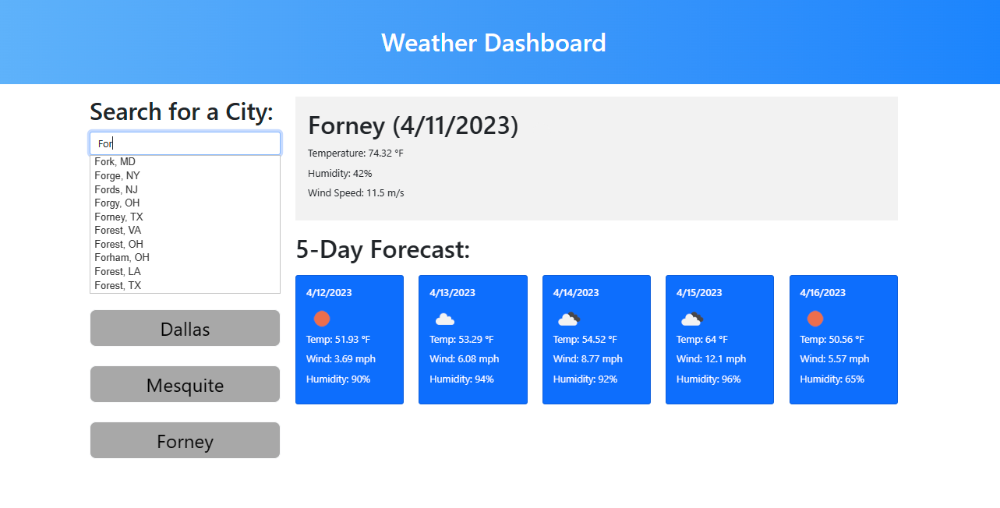

# Weather Dashboard

Weather Dashboard is a web application that allows users to search for a city and see what the weather is like there.
With an easy-to-use interface, it provides current weather, and a 5 day forecast. 

## Features

* Search for a city with the auto populating search bar
* Gets your current location so on startup it will display your current locations weather without having to input it into search first.
* Displays 5 day forecast
* Save search history locally for easy access to previous searches.

## Getting Started
To set up Weather Dashboard on your local machine, follow these instructions:

* Clone the repository.
* Install the required dependencies.
* Obtain API keys from [geonamesApi](https://www.geonames.org/login) and [OpenWeatherMapAPI](https://openweathermap.org/api)
* Replace the placeholders in the code with your API keys.
* Open the index.html file in your favorite browser.

## Technologies Used 
* HTML
* CSS
* JavaScript
* Search Auto Complete with GeoNamesAPI 
* Find current location with openstreetmap.org API
* Get weather data with openweathermap.org API
* Bootstrap
* jquery

##  Links

[Git Page Deployment](https://daniel-covington.github.io/Weather_Dashboard/)

[Git Hub](https://github.com/Daniel-Covington/Weather_Dashboard)

## Preview

The following image demonstrates the web application's appearance and functionality:

